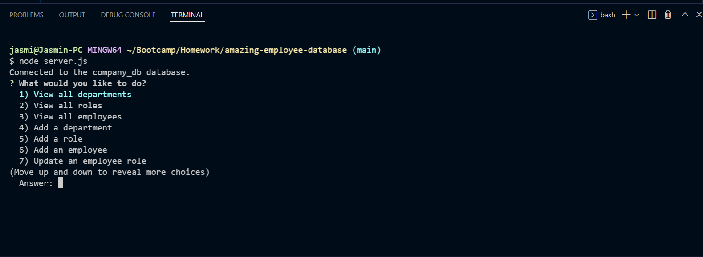

# Amazing-Employee-Database

  ## Table of contents
  1. [Description](#Description)
  1. [Installation](#Installation)
  1. [Usage](#Usage)
  1. [Visuals](#Visuals)
  1. [Video](#Video)
  1. [Deployed](#Deployed)

  
  ## Description
  This is a terminal based application. In this application you will be able to view all employees,department and roles within your company database. You will also be able to add employees, and roles.

## Installation
npm install

## Usage
You must import the database. Use mySQl and run the schema, and seed information to view it:

Steps:

mysql -u root -p
SOURCE db/schema.sql
SOURCE db/seeds.sql
exit

Run Application:

node server.js

  ## Visuals

## Video

[Click to watch a walkthrough video of the team generator](https://drive.google.com/file/d/1lXct7f5x9kPXduJdtOaN5go0mhGnWelT/view)
## Deployed
[Click to go to my GitHub repo](https://github.com/jasminbouasavatdy/amazing-employee-database)
